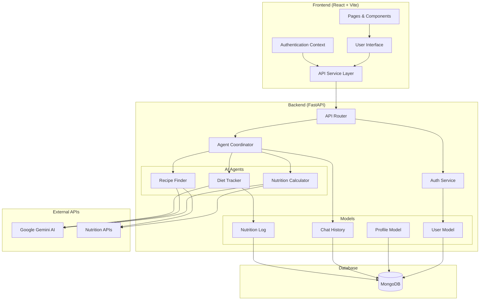

# Diet Plan AI Agent 🥗🤖

A sophisticated multi-agent AI system for personalized diet planning, nutrition analysis, and recipe recommendations. Built with modern web technologies and powered by advanced AI agents.

## 🌟 Features

### 🤖 Multi-Agent AI System
- **Nutrition Calculator Agent**: Analyzes food nutritional content and calculates daily intake
- **Recipe Finder Agent**: Suggests personalized recipes based on dietary preferences and restrictions
- **Diet Tracker Agent**: Monitors daily food intake and provides insights on dietary goals
- **Agent Coordinator**: Orchestrates collaboration between specialized agents

### 💻 Modern Web Interface
- **Responsive Design**: Beautiful, mobile-first UI built with React and Tailwind CSS
- **Real-time Chat**: Interactive chat interface for seamless AI communication
- **User Dashboard**: Comprehensive overview of nutrition stats and progress tracking
- **Profile Management**: Detailed user profile with health goals and dietary preferences

### 🔐 Secure Authentication
- **JWT-based Authentication**: Secure user registration and login system
- **Protected Routes**: Role-based access control for user data
- **Password Encryption**: Advanced password hashing with bcrypt

### 📊 Data Management
- **MongoDB Integration**: Scalable NoSQL database for user data and chat history
- **Real-time Updates**: Live data synchronization across the application
- **Chat History**: Persistent conversation storage and retrieval

## 🏗️ System Architecture



## 🚀 Getting Started

### Prerequisites

- **Node.js** (v18 or higher)
- **Python** (v3.8 or higher)
- **MongoDB** (local or cloud instance)
- **Google Gemini API Key**

### Installation

#### 1. Clone the Repository
```bash
git clone https://github.com/Wimukthi316/Diet_Plan_AI_Agent.git
cd Diet_Plan_AI_Agent
```

#### 2. Backend Setup
```bash
# Create virtual environment
python -m venv venv

# Activate virtual environment
# Windows
venv\Scripts\activate
# macOS/Linux
source venv/bin/activate

# Install Python dependencies
pip install -r requirements.txt

# Set up environment variables
cp .env.example .env
# Edit .env file with your configuration
```

#### 3. Frontend Setup
```bash
# Navigate to frontend directory
cd frontend

# Install Node.js dependencies
npm install

# Start development server
npm run dev
```

#### 4. Environment Configuration

Create a `.env` file in the root directory:

```env
# Database Configuration
MONGODB_URL=mongodb://localhost:27017/diet_ai
DATABASE_NAME=diet_ai

# JWT Configuration
JWT_SECRET_KEY=your-super-secret-jwt-key
JWT_ALGORITHM=HS256
JWT_ACCESS_TOKEN_EXPIRE_MINUTES=1440

# Google AI Configuration
GOOGLE_API_KEY=your-google-gemini-api-key

# Server Configuration
HOST=0.0.0.0
PORT=8000

# CORS Configuration
FRONTEND_URL=http://localhost:3000
```

#### 5. Start the Application

```bash
# Terminal 1: Start Backend (from root directory)
python main.py

# Terminal 2: Start Frontend (from frontend directory)
cd frontend
npm run dev
```

The application will be available at:
- **Frontend**: http://localhost:3000
- **Backend API**: http://localhost:8000
- **API Documentation**: http://localhost:8000/docs

## 📁 Project Structure

```
Diet_Plan_AI_Agent/
├── backend/                    # Backend Python application
│   ├── agents/                 # AI agent implementations
│   │   ├── base_agent.py       # Base agent class
│   │   ├── coordinator.py      # Agent coordination logic
│   │   ├── diet_tracker.py     # Diet tracking agent
│   │   ├── nutrition_calculator.py  # Nutrition calculation agent
│   │   └── recipe_finder.py    # Recipe recommendation agent
│   ├── models/                 # Database models
│   │   ├── chat_history.py     # Chat message model
│   │   ├── database.py         # Database configuration
│   │   ├── diet_plan.py        # Diet plan model
│   │   ├── nutrition_log.py    # Nutrition logging model
│   │   └── user.py             # User and profile models
│   ├── services/               # Business logic services
│   │   └── auth.py             # Authentication service
│   └── utils/                  # Utility functions
│       └── security.py         # Security utilities
├── frontend/                   # Frontend React application
│   ├── public/                 # Static assets
│   │   ├── favicon.ico         # Application favicon
│   │   ├── login.jpg           # Login page image
│   │   └── register.jpg        # Registration page image
│   ├── src/                    # Source code
│   │   ├── components/         # Reusable React components
│   │   │   ├── FaviconIcon.jsx # Favicon component
│   │   │   ├── Layout.jsx      # App layout wrapper
│   │   │   └── LoadingSpinner.jsx  # Loading component
│   │   ├── contexts/           # React contexts
│   │   │   └── AuthContext.jsx # Authentication context
│   │   ├── pages/              # Page components
│   │   │   ├── ChatPage.jsx    # AI chat interface
│   │   │   ├── Dashboard.jsx   # User dashboard
│   │   │   ├── LandingPage.jsx # Landing page
│   │   │   ├── LoginPage.jsx   # User login
│   │   │   ├── ProfilePage.jsx # User profile management
│   │   │   └── RegisterPage.jsx # User registration
│   │   ├── services/           # API services
│   │   │   └── api.js          # API client configuration
│   │   ├── App.jsx             # Main App component
│   │   ├── index.css           # Global styles
│   │   └── main.jsx            # Application entry point
│   ├── index.html              # HTML template
│   ├── package.json            # Node.js dependencies
│   ├── tailwind.config.js      # Tailwind CSS configuration
│   └── vite.config.js          # Vite build configuration
├── main.py                     # FastAPI application entry point
├── requirements.txt            # Python dependencies
└── README.md                   # Project documentation
```

## 🔧 Configuration

### Database Setup

1. **MongoDB Installation**:
   - Install MongoDB locally or use MongoDB Atlas (cloud)
   - Create a database named `diet_ai`
   - Update connection string in `.env` file

2. **Collections**:
   - `users`: User accounts and profiles
   - `chat_messages`: Chat history storage
   - `nutrition_logs`: Daily nutrition tracking
   - `diet_plans`: Personalized diet plans

### AI Configuration

1. **Google Gemini API**:
   - Obtain API key from Google AI Studio
   - Add key to `.env` file as `GOOGLE_API_KEY`
   - Configure model parameters in agent files

2. **Agent Customization**:
   - Modify prompts in `backend/agents/` files
   - Adjust response formatting in coordinator
   - Fine-tune collaboration logic between agents

## 🎯 Usage

### User Registration & Authentication
1. **Sign Up**: Create account with email and password
2. **Complete Profile**: Add personal information (age, weight, height, goals)
3. **Set Preferences**: Configure dietary restrictions and health goals

### AI Chat Interface
1. **Ask Questions**: Natural language queries about nutrition and diet
2. **Get Recommendations**: Personalized recipe suggestions
3. **Track Progress**: Monitor daily nutrition intake
4. **Analyze Foods**: Get detailed nutritional breakdowns

### Dashboard Features
1. **Statistics Overview**: Daily/weekly nutrition summaries
2. **Goal Tracking**: Progress towards health objectives
3. **Recipe Collections**: Saved and recommended recipes
4. **Chat History**: Review past AI conversations

## 🧪 API Documentation

### Authentication Endpoints
```
POST /auth/register    # User registration
POST /auth/login       # User login
GET  /user/profile     # Get user profile
PUT  /user/profile     # Update user profile
```

### Chat Endpoints
```
POST   /chat           # Send message to AI agents
GET    /chat/history   # Retrieve chat history
DELETE /chat/history   # Clear chat history
```

### Health Endpoints
```
GET /health           # API health check
GET /                 # API information
```

## 🧠 AI Agent Details

### Nutrition Calculator Agent
- **Purpose**: Analyzes food nutritional content
- **Capabilities**: Calorie calculation, macro/micronutrient breakdown
- **Data Sources**: Multiple nutrition databases and APIs

### Recipe Finder Agent  
- **Purpose**: Recommends recipes based on preferences
- **Capabilities**: Ingredient substitution, dietary restriction filtering
- **Features**: Cooking time estimation, difficulty rating

### Diet Tracker Agent
- **Purpose**: Monitors and analyzes dietary intake
- **Capabilities**: Daily nutrition summaries, goal progress tracking
- **Insights**: Personalized recommendations and health tips

## 🎨 Frontend Technologies

- **React 18**: Modern React with hooks and concurrent features
- **Vite**: Fast build tool and development server
- **Tailwind CSS**: Utility-first CSS framework
- **React Router**: Client-side routing
- **Lucide React**: Beautiful, customizable icons
- **React Hot Toast**: Elegant toast notifications

## ⚙️ Backend Technologies

- **FastAPI**: High-performance async web framework
- **MongoDB**: NoSQL database with Beanie ODM
- **JWT**: JSON Web Token authentication
- **Google Gemini**: Advanced AI language model
- **Uvicorn**: ASGI server for production deployment

## 🚀 Deployment

### Docker Deployment (Recommended)

```bash
# Build and run with Docker Compose
docker-compose up -d

# Or build manually
docker build -t diet-ai-backend .
docker build -t diet-ai-frontend ./frontend
```

### Manual Deployment

1. **Backend Deployment**:
   ```bash
   # Install production dependencies
   pip install -r requirements.txt
   
   # Run with Gunicorn
   gunicorn main:app -w 4 -k uvicorn.workers.UvicornWorker
   ```

2. **Frontend Deployment**:
   ```bash
   # Build for production
   npm run build
   
   # Serve static files
   npm run preview
   ```

## 🔒 Security Features

- **Password Hashing**: bcrypt with salt rounds
- **JWT Tokens**: Secure authentication with expiration
- **CORS Configuration**: Cross-origin request handling
- **Input Validation**: Pydantic models for data validation
- **Rate Limiting**: API endpoint protection
- **Error Handling**: Comprehensive error responses

## 🧪 Testing

```bash
# Backend tests
pytest backend/tests/

# Frontend tests
cd frontend
npm run test

# End-to-end tests
npm run test:e2e
```

## 📈 Performance Optimizations

- **Async Operations**: Non-blocking I/O for better performance
- **Database Indexing**: Optimized queries with MongoDB indexes
- **Response Caching**: Strategic caching for frequent requests
- **Code Splitting**: Lazy loading of React components
- **Image Optimization**: Compressed assets for faster loading

## 🤝 Contributing

1. Fork the repository
2. Create feature branch (`git checkout -b feature/AmazingFeature`)
3. Commit changes (`git commit -m 'Add some AmazingFeature'`)
4. Push to branch (`git push origin feature/AmazingFeature`)
5. Open a Pull Request

### Development Guidelines

- Follow PEP 8 for Python code
- Use ESLint and Prettier for JavaScript
- Write comprehensive tests
- Update documentation
- Follow semantic versioning

## 📝 License

This project is licensed under the MIT License - see the [LICENSE](LICENSE) file for details.

## 🙏 Acknowledgments

- **Google Gemini AI** for advanced language processing
- **MongoDB** for flexible data storage
- **React Team** for the excellent frontend framework
- **FastAPI** for the high-performance backend framework
- **Tailwind CSS** for the beautiful UI components

## 📞 Support

- **Issues**: [GitHub Issues](https://github.com/Wimukthi316/Diet_Plan_AI_Agent/issues)
- **Discussions**: [GitHub Discussions](https://github.com/Wimukthi316/Diet_Plan_AI_Agent/discussions)
- **Email**: [wimukthi316@gmail.com](mailto:wimukthi316@gmail.com)

## 🔮 Future Enhancements

- [ ] Mobile application (React Native)
- [ ] Advanced meal planning algorithms
- [ ] Integration with fitness trackers
- [ ] Social features and community
- [ ] Nutritionist consultation booking
- [ ] AI-powered grocery list generation
- [ ] Voice interaction capabilities
- [ ] Multi-language support

---

<div align="center">
  <p>Made with ❤️ by <a href="https://github.com/Wimukthi316">Wimukthi316</a></p>
  <p>⭐ Star this repository if you found it helpful!</p>
</div>